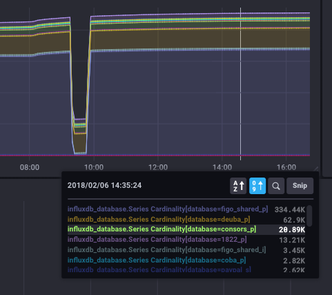
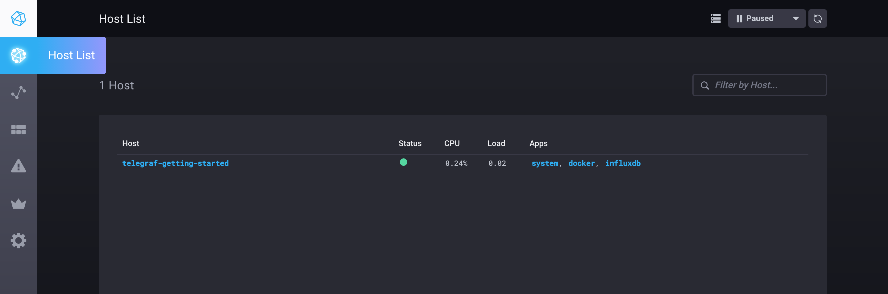
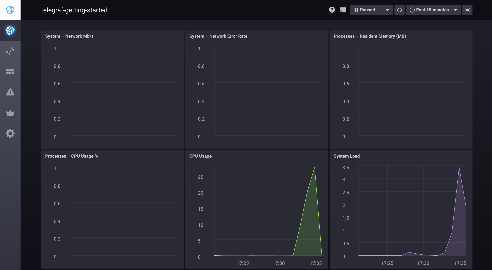

# InfluxData 1.x Sandbox

***[InfluxDB 2.x is now available](https://portal.influxdata.com/downloads/) and available via [Docker Hub](https://hub.docker.com/_/influxdb).  
InfluxDB 2.x includes a native user interface, batch-style task processing and more. [Get Started Here!](https://docs.influxdata.com/influxdb/v2.0/get-started/)***

This repo is a quick way to get the entire 1.x TICK Stack spun up and working together. It uses [Docker](https://www.docker.com/) to spin up the full TICK stack in a connected 
fashion. This is heavily tested on MacOS and should mostly work on Linux and Windows.

To get started you need a running docker installation. If you don't have one, you can download Docker for [Mac](https://www.docker.com/docker-mac) or [Windows](https://www.docker.com/docker-windows), or follow the installation instructions for Docker CE for your [Linux distribution](https://docs.docker.com/engine/installation/#server).

### Running

To run the `sandbox`, simply use the convenient cli:

```bash
$ ./sandbox
sandbox commands:
  up           -> spin up the sandbox environment (add -nightly to grab the latest nightly builds of InfluxDB and Chronograf)
  down         -> tear down the sandbox environment
  restart      -> restart the sandbox
  influxdb     -> attach to the influx cli
  flux         -> attach to the flux REPL

  enter (influxdb||kapacitor||chronograf||telegraf) -> enter the specified container
  logs  (influxdb||kapacitor||chronograf||telegraf) -> stream logs for the specified container

  delete-data  -> delete all data created by the TICK Stack
  docker-clean -> stop and remove all running docker containers
  rebuild-docs -> rebuild the documentation container to see updates
```

To get started just run `./sandbox up`. You browser will open two tabs:

- `localhost:8888` - Chronograf's address. You will use this as a management UI for the full stack
- `localhost:3010` - Documentation server. This contains a simple markdown server for tutorials and documentation.

> NOTE: Make sure to stop any existing installations of `influxdb`, `kapacitor` or `chronograf`. If you have them running the Sandbox will run into port conflicts and fail to properly start. In this case stop the existing processes and run `./sandbox restart`. Also make sure you are **not** using _Docker Toolbox_.

Once the Sandbox launches, you should see your dashboard appear in your browser:



You are ready to get started with the TICK Stack!

Click the Host icon in the left navigation bar to see your host (named `telegraf-getting-started`) and its overall status.


You can click on `system` hyperlink to see a pre-built dashboard visualizing the basic system stats for your
host, then check out the tutorials at `http://localhost:3010/tutorials`.

If you are using the nightly builds and want to get started with Flux, make sure you check out the [Getting Started with Flux](./documentation/static/tutorials/flux-getting-started.md) tutorial.

> Note: see [influx-stress](https://github.com/influxdata/influx-stress) to create data for your Sandbox.


