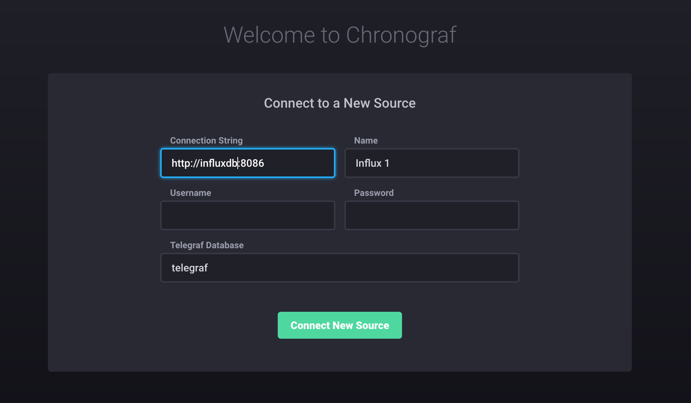
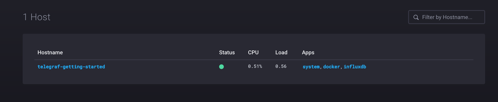
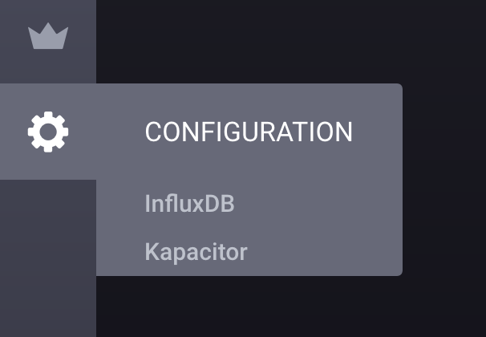
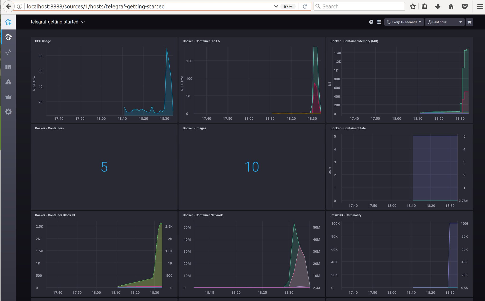

# TICK Sandbox

This repo is a quick way to get the entire TICK Stack spun up and working together. It uses [docker](https://www.docker.com/) to spin up the full TICK stack in a connected fashion. This is heavily tested on Mac and should mostly work on linux.

To get started you need a running docker installation. If you do not have one, go [here and download](https://docs.docker.com/docker-for-mac/install/) the Stable release.

### Running 

To run the `sandbox`, simply use the convenient cli:

```bash
$ ./sandbox
sandbox commands:
  up           -> spin up the sandbox environment
  down         -> tear down the sandbox environment
  restart      -> restart the sandbox
  influxdb     -> attach to the influx cli
  
  enter (influxdb||kapacitor||chronograf||telegraf) -> enter the specified container
  logs  (influxdb||kapacitor||chronograf||telegraf) -> stream logs for the specified container
  
  delete-data  -> delete all data created by the TICK Stack
  docker-clean -> stop and remove all running docker containers
  rebuild-docs -> rebuild the documentation container to see updates
```

To get started just run `./sandbox up`. You browser will open two tabs:

- `localhost:8888` - Chronograf's address. You will use this as a management UI for the full stack
- `localhost:3000` - Documentation server. This contains a simple markdown server for some tutorials and documentation.

> NOTE: Make sure to stop any existing installations of `influxdb`, `kapacitor` or `chronograf`. If you have them running the sandbox will run into port conflicts and fail to properly start. In this case stop the existing processes and run `./sandbox restart`.

To configure the connection to InfluxDB from Chronograf just fill in `http://influxdb:8086` as the URL:



Once you have configured the InfluxDB URL you should see your dashboard:



Then click on the gear icon and select `Kapacitor`:



Finally, enter `http://kapacitor:9092` as the URL and click `Connect Kapacitor`:


Then you are ready to get started with the TICK Stack!

Visit `http:localhost:8888` and click the host to see your dashboard!
>Note: see [influx-stress](https://github.com/influxdata/influx-stress) to create data for your sandbox. 
>


