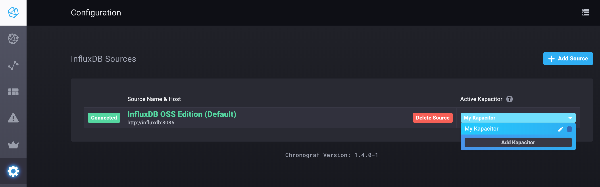
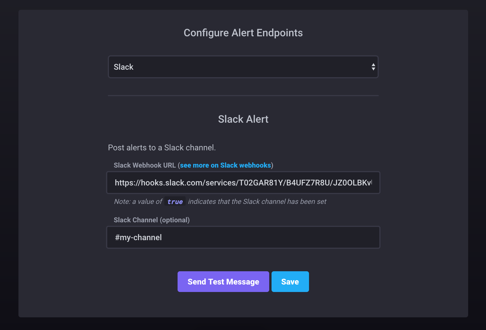
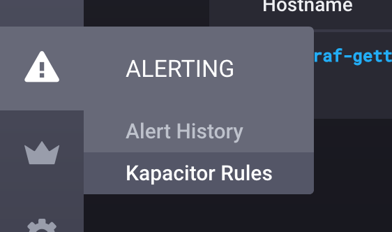
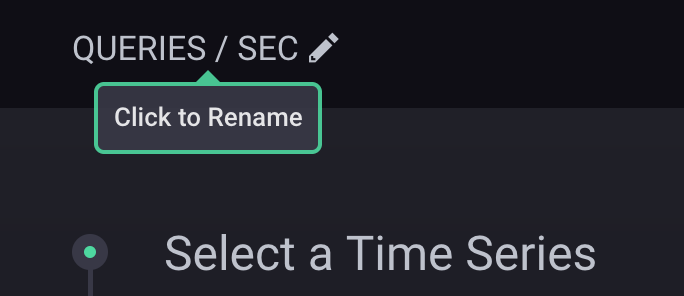
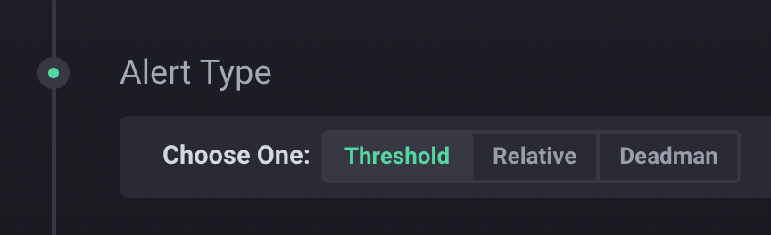
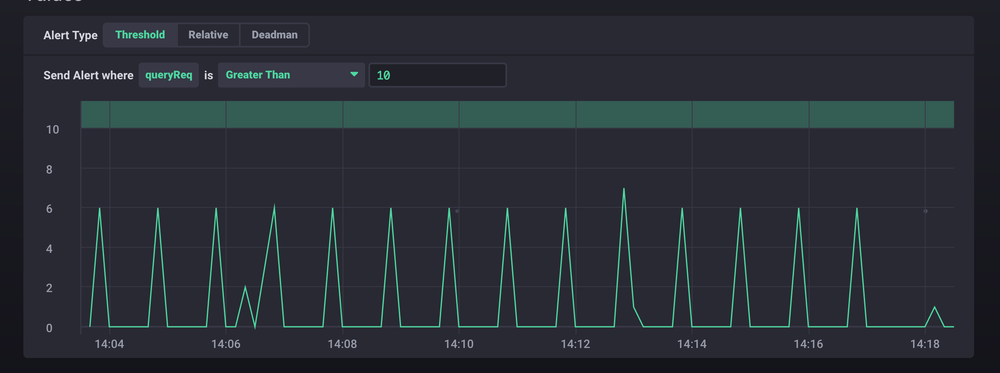
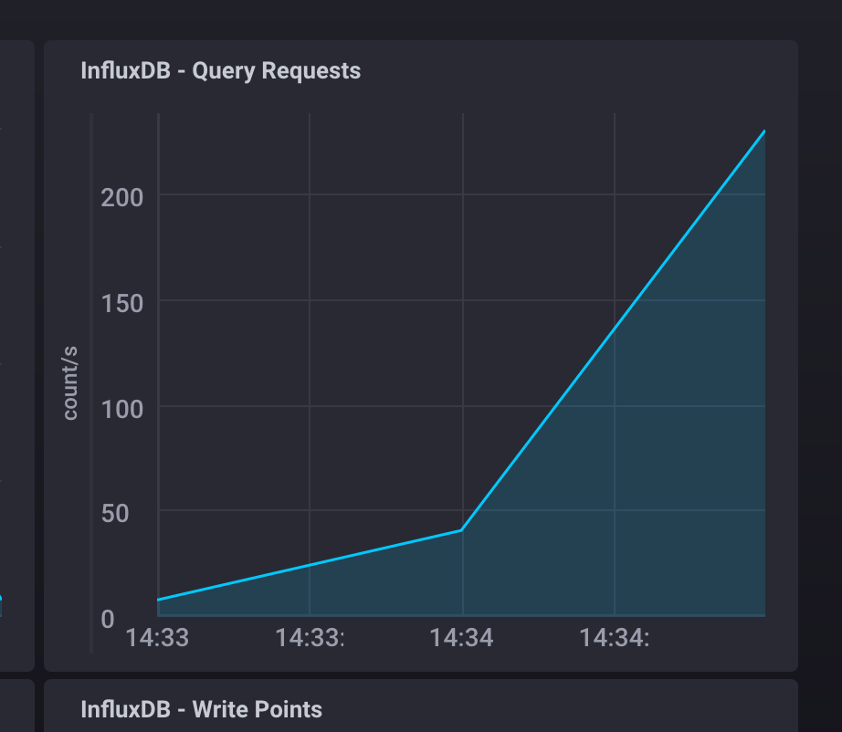
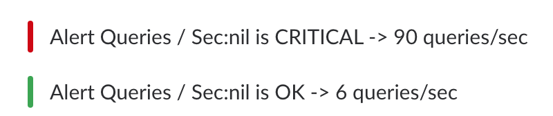
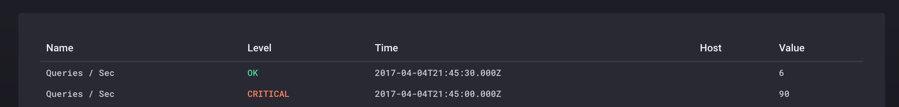

# Create (and trigger) your first Kapacitor Alert

Chronograf makes creating alerts in Kapacitor quick and easy! For our first alert we are going to send a message to slack when there is significant query load on our InfluxDB server. First we are going to need to configure the slack output. You will need to create an [incoming webhook integration](https://api.slack.com/incoming-webhooks) for slack before starting this tutorial. You will need just the `url` which will be in the following format: `https://hooks.slack.com/services/XXXXXXXXX/XXXXXXXXX/XXXXXXXXXXXXXXXXXXXXXXXX`

### Configure Slack integration

First open the Kapacitor configuration section in Chronograf, by selecting the Configuration option ("gear" icon) within the left-hand navigation panel.
Then, select the drop list on the data source under the Active Kapacitor description. From within the drop list you can
click the "pencil" icon to access the Kapacitor configuration options:



Then select the Slack tab and add the webhook URL and Slack channel to post to:



### Use the rule builder

Navigate to the Rule Builder by selecting `Create` from the Alert option ("warning" icon) within the left-hand navigation panel. Next, click on the `Build Rule` button in the upper right portion of the page:



The first step in building a rule is to give it a name.  Let's name this one: `Queries/Second`



Next, select the alert type.  In this example, select the default value `threshold` is what we will use.



Make the following choices in the `Time Series` section. We are using the [`spread`](https://docs.influxdata.com/influxdb/v1.4/query_language/functions/#spread) function:

```
database:    'telegraf'
measurement: 'influxdb_httpd'
field:       'queryReq'
function:    'spread'
groupByTime: '10s'
groupByTags: 'host'
```
Once completed, the screen shown should look as follows:


The InfluxQL query generated looks like this:
```sql
SELECT spread("queryReq") AS "spread_queryReq"
FROM "telegraf"."autogen"."influxdb_httpd"
WHERE time > now() - 15m
GROUP BY host, time(10s)
```

In the `Conditions` section you need to `Send Alert where queryReq is Greater Than 10`. You should see a visual representation of the alert below that:



Finally you need to set the message you want to send with the alert: `Alert {{ .ID }} is {{ .Level }} -> {{ index .Fields "value" }}`. Clicking `Save Rule` at the top of the page [defines and enables](https://docs.influxdata.com/chronograf/v1.4/guides/create-a-kapacitor-alert/#step-6-save-the-alert-rule) the rule.

### Trigger it! See some alerts!

The easiest way to trigger an alert from this rule is to go to the `influxdb` canned dashboard under the `telegraf-getting-started` host and refreshing the page ~5-10 times in quick succession. You should see the precanned `InfluxDB - Query Requests` graph spike:



Then check the `Alerting -> Alert History` section of kapacitor or your output Slack channel to see the resulting alerts:

## Slack


## Chronograf

