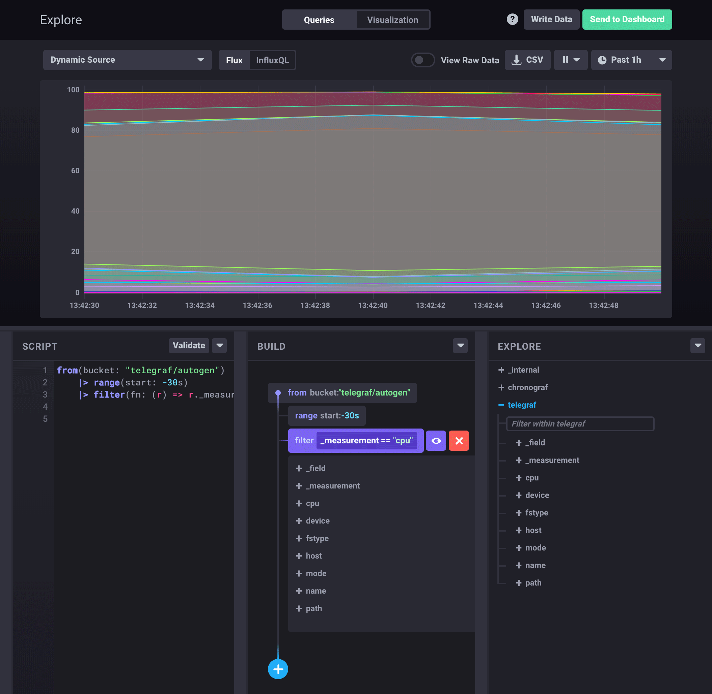
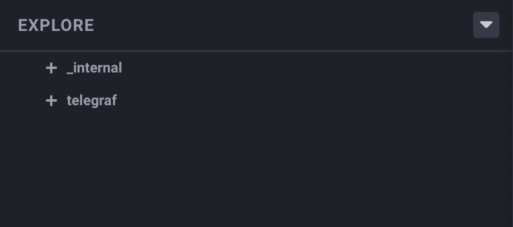
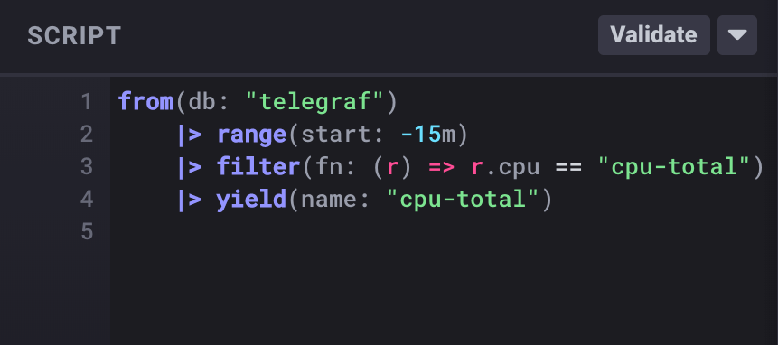
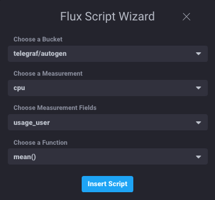
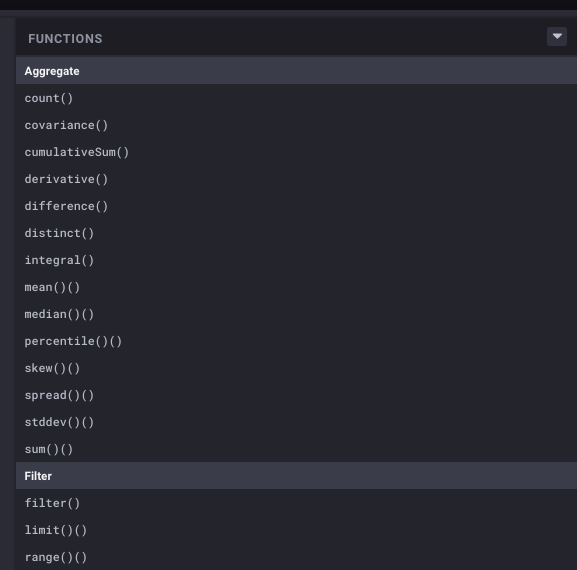

# Get Started with Flux
Flux is InfluxData's new data language designed for querying, analyzing, and acting on data stored in InfluxDB.
Its takes the power of InfluxQL and the TICKscript and combines them into a single, unified data scripting language.

## Using Flux with the Sandbox
Starting with the 1.7 releases of Chronograf and InfluxDB, Flux is now completely integrated within 
the [InfluxData Sandbox](https://github.com/influxdata/sandbox).

There will be ongoing updates and refinements made to the language and the implementation.  So, you can always grab the
latest by starting the Sandbox with the `-nightly` flag to pull the nightly builds of InfluxDB and
Chronograf.

```bash
./sandbox up -nightly
```

### Flux via CLI
Integrated within the InfluxCLI is a Flux Read-Eval-Print-Loop (REPL) Command Line Interface.  

To access the Flux REPL:
```
// Enter the docker container containing the InfluxCLI from the command prompt
$ ./sandbox enter influxdb  

// Once inside the container, start the InfluxCLI tool using the -type flux option
# influx -type flux

//The following should appear
Connected to http://localhost:8086 version 1.7.0
InfluxDB shell version: 1.7.0
Enter a Flux query
>
```

__Remember to use CTL+D to exit the Flux REPL.__

### Get started with the Flux Editor via Chronograf
The Flux Editor makes working with Flux a visual process. It consists of 3 panes:

1. **[Schema Explorer](#schema-explorer)** Allows you to explore the actual structure of your data as you're building Flux scripts.
2. **[Script Editor](#script-editor)** Where the actual Flux code is written and displayed.
3. **[Function Explorer](#function-explorer)** An online quick reference for many Flux functions.



Each pane can be minimized, maximized, or closed depending on how you want to work.

### Schema Explorer
The "Explore" pane of the Flux Editor allows you to visual explore the structure of your data.
This is incredibly helpful as you're building out Flux queries.



### Script Editor
Flux queries are written in the "Script" pane of the Flux Editor.


You can use the "explorer" tools around the Script Editor to help you rapidly build out queries.
There is also a Script Wizard as part of the Script Editor which allows you to quickly build out the first few 
lines of your Flux Script.  



After you've written your query you can hit the "Run Script" button in the Script Editor to execute the query. 

You may want to toggle the "View Raw Data" button above the query visualization panel to switch between your 
selected visualization and the data returned by the query you've constructed.  The default visualization type is
a line graph.  But, you can select the "Visualization" at the top middle of the screen to alter how the query 
results are displayed.

### Function Explorer
The Function Explorer lists the various Flux Functions and in-line documentation describing the function's description,
arguments, and an example for how to use it.  Scroll through the functions to explore the power of Flux.



## Learn the basics of the Flux language
Flux draws inspiration from programming languages such as Lisp, Elixir, Elm,
Javascript and others, but is specifically designed for analyzing and acting on data.
For an introduction into the Flux syntax, view the
[Flux Getting Started](https://docs.influxdata.com/flux/latest/introduction/getting-started/)
section of the documentation.


## Additional Information
[Flux Documentation](https://docs.influxdata.com/flux/latest/)  
[Flux Specification](https://github.com/influxdata/flux/blob/master/docs/SPEC.md)   
[Flux Introduction Slides](https://speakerdeck.com/pauldix/flux-number-fluxlang-a-new-time-series-data-scripting-language) 
